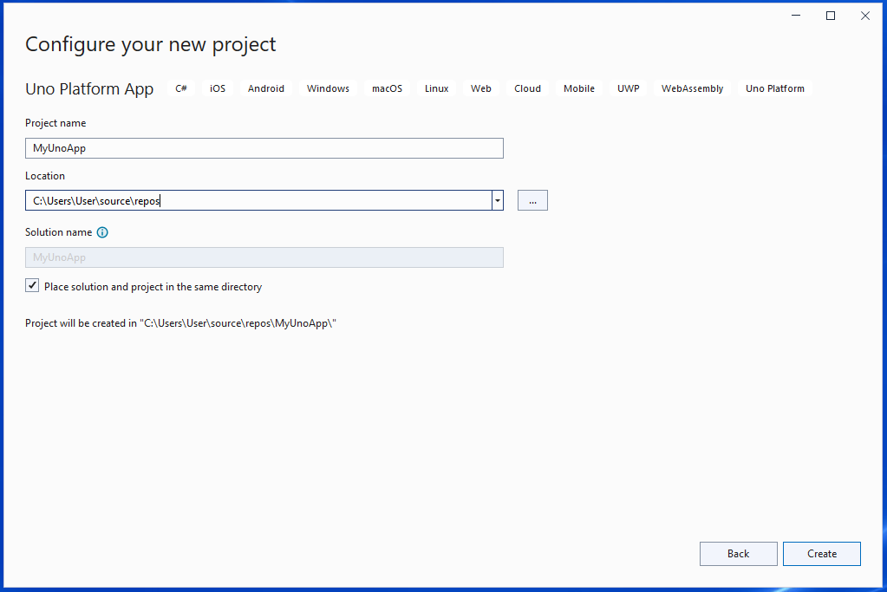
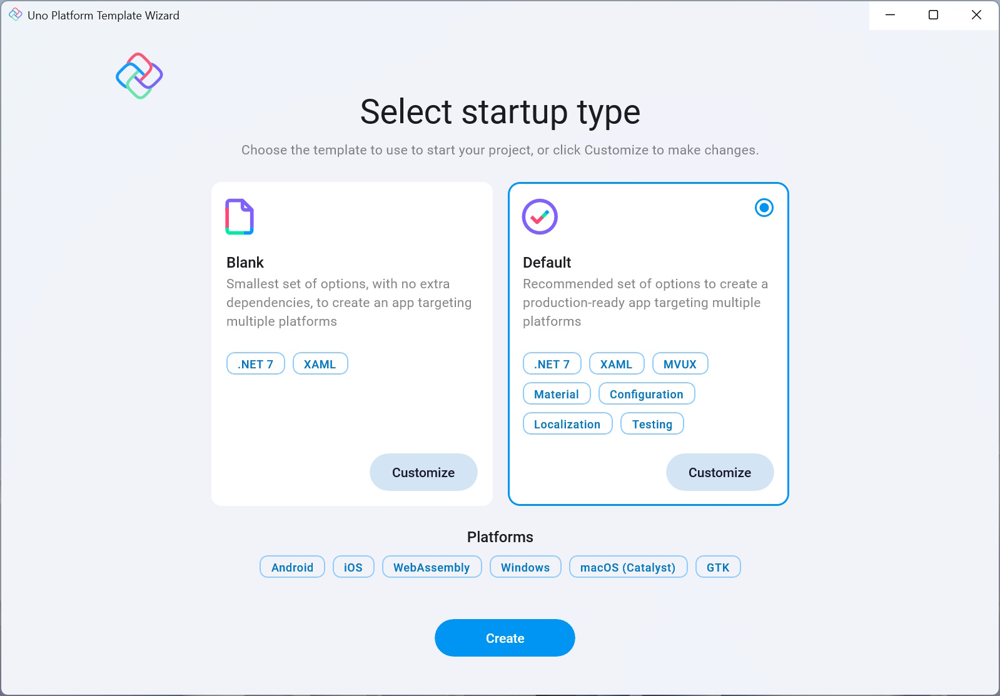

# Creating an app with Visual Studio 2022 for Windows

> [!NOTE]
> Make sure to setup your environment by [following our instructions](xref:Uno.GetStarted.vs2022).

## Create the App
To create an Uno Platform app:
1. Create a new C# solution using the **Uno Platform App** template, from Visual Studio's **Start Page**, then click the **Next** button

      
    

1. Configure your new project by providing a project name and a location, then click the **Create** button

    

1. Choose a template to build your application
   
    

    > [!TIP]
    > For a detailed overview of the Uno Platform project template wizard and all its options, see [this](xref:Uno.GettingStarted.UsingWizard).
    
1. Click the create button

1. Wait for the projects to be created, and their dependencies to be restored

1. A banner at the top of the editor may ask to reload projects, click **Reload projects**:  
    

## Debug the App

# [**Windows**](#tab/windows)

To run the **Windows** (WinAppSDK) head:

- Right-click on the `MyApp.Windows` project, select **Set as startup project**
- Select the `Debug|x86` configuration
- Press the `MyApp.Windows` button to deploy the app
- If you've not enabled Developer Mode, the Settings app should open to the appropriate page. Turn on Developer Mode and accept the disclaimer.

# [**WebAssembly**](#tab/wasm)

To run the **WebAssembly** (Wasm) head:

- Right click on the `MyApp.Wasm` project, select **Set as startup project**
- Press the `MyApp.Wasm` button to deploy the app
- To run/debug your WebAssembly app on a mobile device, you can utilize the Dev Tunnels feature of Visual Studio 2022 (see [Microsoft Learn documentation](https://learn.microsoft.com/aspnet/core/test/dev-tunnels) to get started)

# [**ASP.NET Hosted WebAssembly**](#tab/wasm-hosted)

To run the ASP.NET Hosted **WebAssembly** (Server) head:
- Right click on the `MyApp.Server` project, select **Set as startup project**
- Press the `MyApp.Server` button to deploy the app

# [**iOS**](#tab/iOS)

To debug for **iOS**:
- Right-click on the `MyApp.Mobile` project, select **Set as startup project**
    > [!NOTE]
    > For information about connecting Visual Studio to a Mac build host to build iOS apps, see [Pairing to a Mac for .NET iOS development](https://docs.microsoft.com/en-us/xamarin/ios/get-started/installation/windows/connecting-to-mac/). Catalyst apps are not supported in Visual Studio 2022 on Windows, you can use [VS Code Remote SSH](xref:Uno.GetStarted.vscode) to enable this scenario.

- In the "Debug toolbar" drop-down, select framework `net7.0-ios`:

    
    
- Select:
    - An active device, if your IDE is connected to a macOS Host
    - A [local device using Hot Restart](https://learn.microsoft.com/en-us/xamarin/xamarin-forms/deploy-test/hot-restart), to debug your application without connecting to a mac
    
    > [!NOTE] 
    > If no iOS devices are available, a Visual Studio 17.7+ issue requires unloading/reloading the project. Right-click on the `.Mobile` project and select **Unload Project** then **Load project**.

# [**Android**](#tab/Android)

To debug the **Android** platform:
- Right click on the `MyApp.Mobile` project, select **Set as startup project**
- In the **Debug toolbar** drop down, select framework `net7.0-android`
- Select an active device in the "Device" sub-menu
    > [!NOTE] 
    > If no android devices are available, a Visual Studio 17.7+ issue requires unloading/reloading the project. Right-click on the `.Mobile` project and select **Unload Project** then **Load project**.

# [**Skia+GTK**](#tab/skiagtk)

To debug your **Skia+GTK** head:
- Directly on Windows:
    - Right-click the `MyApp.Skia.Gtk` project, select **Set as startup project**
    - In the debug toolbar, next to the green arrow, select `MyApp.Skia.Gtk`, then press `F5`.
- Using WSL:
    - In the debugger menu, next to the green arrow, press the drop down to select **WSL**
    - If this is the first time debugging the app:
        - Locate and open the `Properties/launchSettings.json` file
        - In the "WSL" section, add the following:
            ```json
            "environmentVariables": {
                "DISPLAY": ":0",
                "GDK_GL": "gles"
            },
            ```
            The section should look then like this:
            ```json
            "WSL": {
                "commandName": "WSL2",
                "distributionName": "",
                "environmentVariables": {
                    "DISPLAY": ":0",
                    "GDK_GL": "gles"
                }
            }
            ```
    - Then press `F5` or the green arrow to start debugging the app

***

You're all set!

> [!IMPORTANT]
> Take a [look at our article](xref:Build.Solution.TargetFramework-override) in order to ensure that your solution is building and showing intellisense as fast as possible, and to avoid [this Visual Studio issue](https://developercommunity.visualstudio.com/t/Building-a-cross-targeted-project-with-m/651372?space=8&q=building-a-cross-targeted-project-with-many-target) (help the community by upvoting it!) where multi-targeted project libraries always build their full set of targets.

## Explore

Next, explore [Uno Platform features and architecture](xref:Uno.GetStarted.Explore).